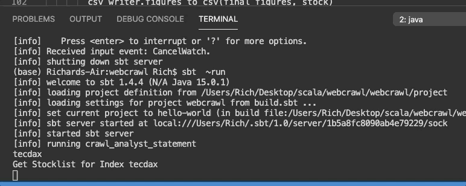

# scala_crawl

scala project to create a large data webcrawl for financial data

# Scala functional programming

# Asyncronous Processing with Futures
The bottleneck of preforming the webcrawl is the formating and writting after the crawl.  

As this is based on a separate links for the different pages this operation is executed asynchron. I used future class for preforming the paralization, as seeing below.

